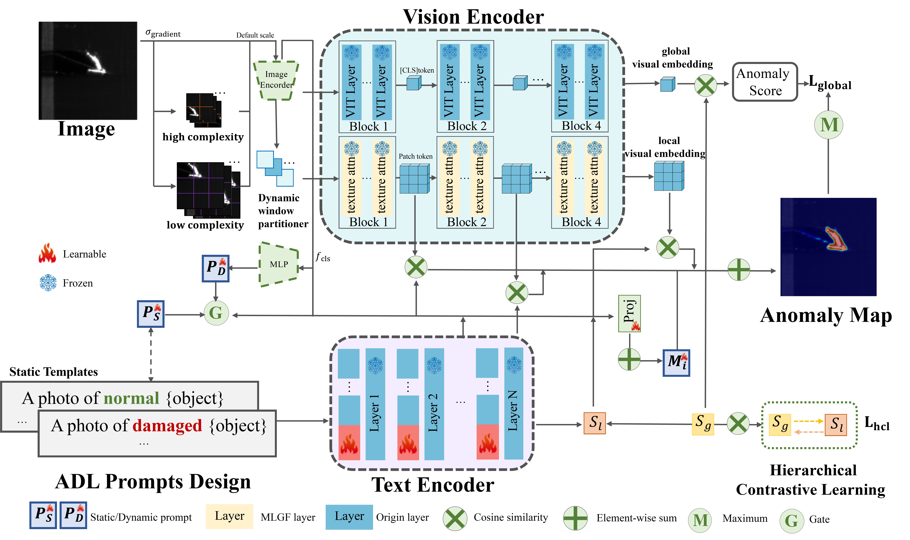
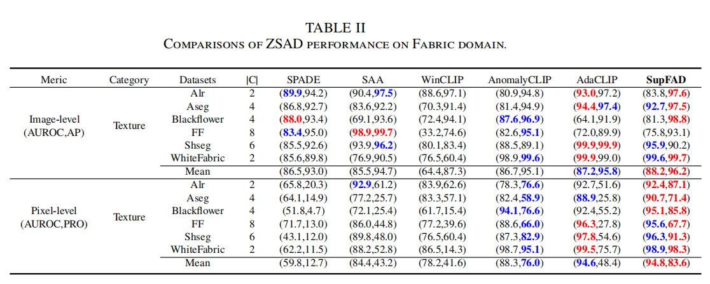
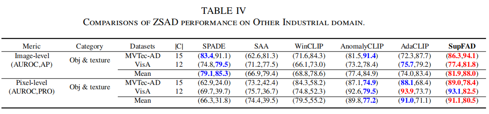

# SupFAD (Train once and test other)
>  [**SupFAD: Superordinary FAD with Adaptive Dynamic Learning Prompts for Zero-Shot Fabric Anomaly Detection**]
>
> by Xinying Li, Junfeng Jing, Tong Wu, Xin Zhang.


## Updates

- **02.10.2025**: The project has already been uploaded.
- **XX.XX.2025**: Code has been released !!!

## Introduction 
Fabric anomaly detection is a necessary part of
the industrial production process. Existing deep learning-based
work has already overcome many difficulties and provided
better detection results. However, previous work has issues in
practical industrial applications, such as slow inference speed,
low detection accuracy, and high manual labeling costs, which
severely affect the efficiency of fabric production. To bridge
this gap, we propose SupFAD, a framework leveraging CLIP as
a backbone (VIT-L-14@336px) through targeted architectural
adaptations. The visual encoder integrates a dynamic window
partitioner that adjusts receptive fields based on fabric texture
complexity, paired with a joint texture attention mechanism to
amplify subtle defect patterns. Multimodal fusion dynamically
combines Adaptive Dynamic Learning Prompts with texture-aware visual adapters. By evaluating on six real-world fabric
datasets collected in real-time from factory environments and
two publicly available industrial datasets, SupFAD outperforms
existing zero-shot anomaly detection(ZSAD) methods in detection
accuracy, achieving state-of-the-art performance. Notably, its
texture-adaptive design enables seamless generalization to non-fabric 
industrial domains, demonstrating robust applicability in
diverse real-world scenarios. Furthermore, our work achieves a
training round of only 13.5 min on a 512 x 512 image, and
SupFAD achieves 9.12FPS in terms of inference speed.

## Framework of SupFAD


## 🛠️ Getting Started

### Installation
To set up the SupFAD environment, follow one of the methods below:

- Clone this repo:
  ```shell
  git clone https://github.com/lixinying0727/SupFAD && cd SupFAD
  ```

- If you prefer to construct the experimental environment manually, follow these steps:
  ```shell
  conda create -n SupFAD python=3.9.0 -y
  conda activate SupFAD
  pip install requirements.txt
  ```

### Dataset Preparation 
Please download our processed visual anomaly detection datasets to your `data` as needed. 

#### Industrial Visual Anomaly Detection Datasets

| Dataset | Google Drive | Baidu Drive | Task
|------------|------------------|------------------| ------------------|
| MVTec AD    | [Google Drive](https://drive.google.com/file/d/12IukAqxOj497J4F0Mel-FvaONM030qwP/view?usp=drive_link) | [Baidu Drive]( https://pan.baidu.com/s/16ruikeaC7EaJl6PVKsp2nA?pwd=1005) | Anomaly Detection & Localization |
| VisA    | [Google Drive](https://drive.google.com/file/d/1U0MZVro5yGgaHNQ8kWb3U1a0Qlz4HiHI/view?usp=drive_link) | [Baidu Drive](https://pan.baidu.com/s/1bjihMHV70Ucm9W4ngpiWDA?pwd=1005) | Anomaly Detection & Localization |

#### Fabric Visual Anomaly Detection Datasets

The datasets generated during the current study are not publicly available due Self-built datasets and limited by industry, but are available from the corresponding author on reasonable request.

#### Custom Datasets
To use your custom dataset, follow these steps:

1. Refer to the instructions in `./generate_dataset_json` to generate the JSON file for your dataset.
2. Use `./generate_dataset_json/your_datasets.py` to construct your own dataset.

Take MVTec AD for example (With multiple anomaly categories)

Keep your dataset architecture consistent

Structure of MVTec Folder:
```
mvtec/
│
├── meta.json
│
├── bottle/
│   ├── ground_truth/
│   │   ├── broken_large/
│   │   │   └── 000_mask.png
|   |   |   └── ...
│   │   └── ...
│   └── test/
│   │   ├── broken_large/
│   │   │   └── 000.png
|   │   |   └── ...
│   │   └── ...
│   └── train/
│       ├── good/
│       │   └── 000.png
|       |   └── ...
└── ...
```


### Weight Preparation

For testing convenience, we provide pre-trained weights for mvtec, visa, and fabric.
Please download the pre-trained weights in `./checkpoints`.

## Run SupFAD
We used MVTec for testing VisA and Fabric, while both MVTec and VisA utilized pre-trained weights from Fabric.
* Quick start (use the pre-trained weights)
```bash
bash test.sh
```
  
* Train your own weights
```bash
bash train.sh
```


## Main results
 We test fabric datasets by training once on MVTec AD. For MVTec AD, SupFAD is trained on fabric.

### Fabric dataset

### Industrial dataset

## Visualization


## We provide the reproduction of AnomlayCLIP [here](https://github.com/zqhang/AnomalyCLIP)


* We thank for the code repository: [AnomalyCLIP](https://github.com/zqhang/AnomalyCLIP), [AdaCLIP](https://github.com/caoyunkang/AdaCLIP).

## Citation

If you find this project helpful for your research, please consider citing the following BibTeX entry.

```BibTex

```

